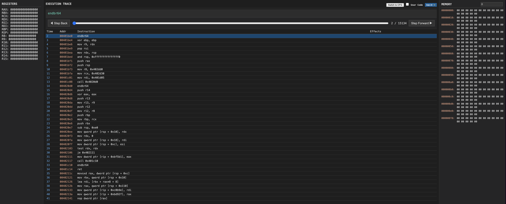
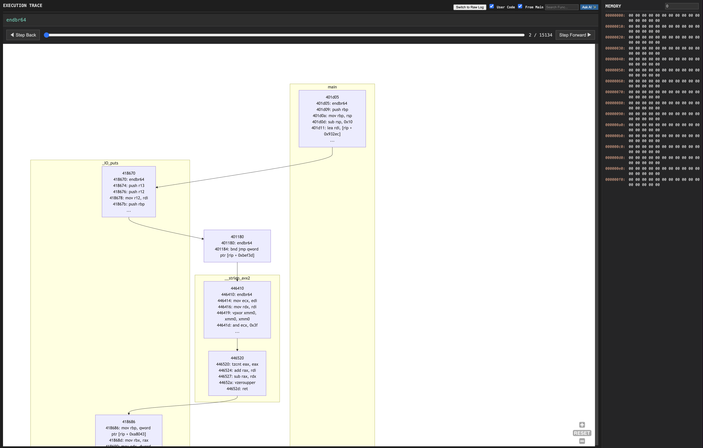

# Koradar
A timeless binary tracer with AI integration, rewritten in Rust for high performance and modern tooling.
with knowledge(ᚴ Kenaz) and insight—like(ᛟ Othala) a radar for your code.
ko-radar.

## Overview

Koradar is a web-based binary analysis and debugging tool that provides **timeless debugging** capabilities—allowing you to navigate through execution history as if time were a variable. It combines the power of QEMU's dynamic binary instrumentation with a modern Rust backend and WebAssembly frontend.



## Features

### Core Capabilities

- **Timeless Debugging**: Navigate through execution history using a time slider. Step forward/backward through any point in execution and view the exact state of registers and memory at that moment.
- **Real-time Tracing**: Capture execution traces from QEMU using a TCG plugin, streaming data via Unix Domain Sockets for minimal overhead.
- **Binary Loading**: Automatically parse and load ELF/PE binaries, displaying code sections and memory layout.
- **Interactive UI**: Modern 3-pane interface (Registers, Execution Trace, Memory) built with Yew (Rust + WebAssembly).
- **Control Flow Graph (CFG)**: Visualize execution flow with "From Main" filter to focus on relevant code.



### Architecture

- **Tracer** (`koradar-tracer`): QEMU TCG Plugin that captures instruction execution and memory accesses.
- **Core** (`koradar-core`): Timeless debugging logic with in-memory `TraceDB` for efficient state reconstruction.
- **Server** (`koradar-server`): Axum-based WebSocket server that brokers data between Tracer, Core, and Frontend.
- **Frontend** (`koradar-frontend`): Yew-based WebAssembly UI for real-time visualization.

## Quick Start

### Prerequisites

- Rust (latest stable)
- QEMU (built from source with plugin support)
- `trunk` (for building the frontend): `cargo install trunk`
- WASM target: `rustup target add wasm32-unknown-unknown`

**Note for macOS users**: QEMU's `linux-user` mode (for tracing Linux binaries) is **not supported on macOS**. This is a QEMU limitation.

**Quick Start on macOS:**
1. **Test UI and server**: `make run` (then open `http://localhost:3000`)
2. **Test with system emulation**: `make trace` (shows "No bootable device" - this is normal)
3. **Trace actual binaries**: See `TESTING_MACOS.md` for Docker-based tracing instructions

**Options:**
1. **Use Linux environment** (recommended): Run Koradar on a Linux machine or VM
2. **Use Docker** (experimental): See `TESTING_MACOS.md` for step-by-step instructions
3. **System emulation only**: Can test plugin loading, but cannot trace binaries directly

See `TESTING_MACOS.md` for detailed macOS testing instructions.

### Building

1. **Setup QEMU** (first time only):
   
   **On Linux:**
   ```bash
   cd koradar
   ./scripts/setup_qemu.sh
   ```
   
   **On macOS** (linux-user mode not supported):
   
   **Option 1: Use Docker** (recommended for testing):
   ```bash
   cd koradar
   ./scripts/setup_qemu_docker.sh  # Build QEMU in Docker
   ./scripts/trace_docker.sh /tmp/koradar_test_hello  # Trace a binary
   ```
   
   **Option 2: Use Linux machine** (recommended for production):
   - Build and run Koradar on a Linux machine where `linux-user` mode is fully supported

2. **Build everything**:
   ```bash
   make setup  # Install trunk and WASM target (first time only)
   make build  # Build all components
   ```

### Running

1. **Start the server** (in one terminal):
   ```bash
   make run
   ```
   This will:
   - Build the frontend (if needed)
   - Start the server on `http://localhost:3000`
   - Open your browser to view the UI

2. **Create a test binary** (optional, for testing):
   ```bash
   make test-binary
   ```
   This creates `/tmp/koradar_test_hello` - a simple Linux x86_64 binary for testing.
   Requires Docker or a cross-compiler.

3. **Run a trace** (in another terminal):
   
   **On Linux:**
   ```bash
   make trace BINARY=/tmp/koradar_test_hello
   ```
   
   **On macOS** (requires Docker):
   ```bash
   ./scripts/trace_docker.sh /tmp/koradar_test_hello
   ```
   
   **System emulation only** (for testing, works on both):
   ```bash
   make trace
   ```
   This starts QEMU system emulation without a binary (monitor only).
   **Note**: This will show "No bootable device" - this is expected behavior.
   System emulation requires a kernel/disk image to actually boot.

4. **Navigate in the browser**:
   - Open `http://localhost:3000` in your browser
   - Use the time slider to jump to any point in execution
   - Click "Step Forward" / "Step Backward" to move one instruction at a time
   - View registers and memory at the selected time point
   - Watch the execution trace update in real-time

## Project Structure

```
koradar/
├── core/          # Core data structures (TraceDB, protocol)
├── tracer/        # QEMU TCG Plugin
├── server/        # WebSocket server
├── frontend/      # Yew WASM frontend
├── scripts/       # Build and utility scripts
├── Makefile       # Build and run commands
└── README.md      # This file
```

## Development Roadmap

### Phase 1: Core Foundation ✅
- [x] QEMU TCG Plugin integration
- [x] Basic WebSocket communication
- [x] 3-pane UI layout
- [x] Binary loading (ELF/PE)
- [x] TraceDB implementation
- [x] Timeless navigation (slider, step buttons)

### Phase 2: Core Analysis & UX (Current)
- [x] Disassembly display (`capstone`)
- [x] Control Flow Graph (CFG) visualization
- [x] URL-based state sharing
- [x] Enhanced memory visualization
- [x] Function search & filtering

### Phase 3: AI-Powered Analysis
- [x] Context-aware prompting engine (OpenAI Integration)
- [ ] Semantic lifting (auto-renaming)
- [ ] Root cause analysis
- [ ] Local/Cloud hybrid LLM support

### Phase 4: Production UI & Ecosystem
- [ ] WebGL/WebGPU visualization
- [ ] Data flow graph
- [ ] WASM plugin system
- [ ] Performance optimizations

## License

[Add your license here]

## Contributing

[Add contribution guidelines here]
